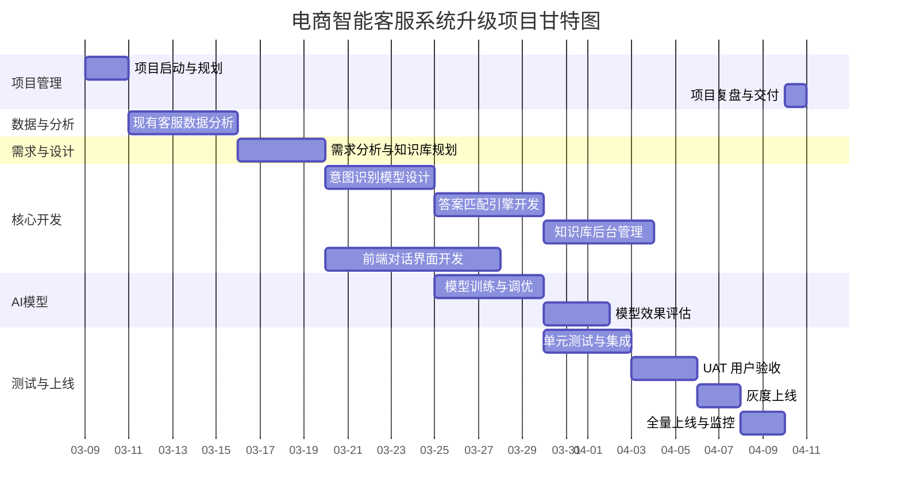

# 电商智能客服系统升级项目计划

**项目目标**: 提升客服自动回复率 50%

---

## 项目概述

| 项目 | 内容 |
|------|------|
| **项目类型** | 技术/IT项目 - 系统升级 |
| **行业** | 零售/电商 |
| **业务目标** | 自动回复率提升 50% |
| **衡量指标** | 自动回复率、平均响应时间、客户满意度 |
| **团队规模** | 6 人 |
| **预计工期** | 约 11 周 (53.5 天) |
| **总人天** | 117 人天 |

---

## 团队成员

| 成员 | 角色 | 技能标签 |
|------|------|----------|
| 张明 | 项目经理 (PM) | 项目管理、沟通协调、干系人管理 |
| 李华 | 产品经理 (PM) | 需求分析、业务梳理、用户体验 |
| 王强 | 算法工程师 | NLP、意图识别、模型训练 |
| 陈磊 | 后端开发 | Python/Go、API设计、数据库 |
| 赵敏 | 前端开发 | Vue/React、UI交互、响应式 |
| 周婷 | 测试工程师 | 功能测试、自动化、性能测试 |

---

## 任务列表 (WBS)

| 序号 | 任务名称 | 工期 (天) | 依赖项 | 负责人 |
|------|----------|-----------|--------|--------|
| 1 | 项目启动与规划 | 2 | - | 张明 |
| 2 | 现有客服数据分析 | 5 | 1 | 李华 |
| 3 | 需求分析与知识库规划 | 4 | 2 | 李华 |
| 4 | 意图识别模型设计 | 5 | 3 | 王强 |
| 5 | 答案匹配引擎开发 | 5 | 4 | 陈磊 |
| 6 | 前端对话界面开发 | 8 | 3 | 赵敏 |
| 7 | 知识库后台管理 | 5 | 5 | 陈磊 |
| 8 | 模型训练与调优 | 5 | 4 | 王强 |
| 9 | 单元测试与集成 | 4 | 5,6,7 | 周婷 |
| 10 | 模型效果评估 | 3 | 8 | 周婷 |
| 11 | UAT 用户验收 | 3 | 9,10 | 周婷 |
| 12 | 灰度上线 | 2 | 11 | 陈磊 |
| 13 | 全量上线与监控 | 2 | 12 | 陈磊 |
| 14 | 项目复盘与交付 | 1 | 13 | 张明 |

---

## 里程碑

| 里程碑 | 计划完成日 | 交付物 |
|--------|------------|--------|
| M1: 项目启动 | Day 2 | 项目章程、范围定义 |
| M2: 数据分析完成 | Day 11 | 分析报告、知识库初稿 |
| M3: 核心算法完成 | Day 21 | 意图识别+匹配引擎 |
| M4: 功能开发完成 | Day 34 | 完整对话系统 |
| M5: 模型达标 | Day 37 | 准确率/召回率达标 |
| M6: 上线交付 | Day 45 | 正式上线、监控就绪 |

---

## 项目甘特图

---

## Phase 2: 估算明细

### 三点估算汇总

| 指标 | 数值 |
|------|------|
| **期望总工期** | 53.5 天 |
| **标准差** | 3.3 天 |
| **95%置信区间** | 47 ~ 60 天 |
| **总人天** | 117 人天 |
| **风险储备** | 17 人天 |

### 任务估算明细

| 任务 | 乐观 | 最可能 | 悲观 | 期望工期 | 人力 | 总人天 |
|------|------|--------|------|----------|------|--------|
| 项目启动与规划 | 1 | 2 | 3 | 2.0 | 2 | 4.0 |
| 现有客服数据分析 | 3 | 5 | 8 | 5.2 | 2 | 10.3 |
| 需求分析与知识库规划 | 3 | 4 | 6 | 4.2 | 2 | 8.3 |
| 意图识别模型设计 | 4 | 5 | 7 | 5.2 | 2 | 10.3 |
| 答案匹配引擎开发 | 4 | 5 | 8 | 5.3 | 2 | 10.7 |
| 前端对话界面开发 | 6 | 8 | 12 | 8.3 | 2 | 16.7 |
| 知识库后台管理 | 4 | 5 | 7 | 5.2 | 1 | 5.2 |
| 模型训练与调优 | 3 | 5 | 9 | 5.3 | 2 | 10.7 |
| 单元测试与集成 | 3 | 4 | 6 | 4.2 | 3 | 12.5 |
| 模型效果评估 | 2 | 3 | 5 | 3.2 | 2 | 6.3 |
| UAT 用户验收 | 2 | 3 | 5 | 3.2 | 3 | 9.5 |
| 灰度上线 | 1 | 2 | 3 | 2.0 | 2 | 4.0 |
| 全量上线与监控 | 1 | 2 | 4 | 2.2 | 3 | 6.5 |
| 项目复盘与交付 | 1 | 1 | 2 | 1.2 | 2 | 2.3 |

### 按角色人天分解

| 角色 | 投入人天 | 占比 |
|------|----------|------|
| 项目经理 | 20.0 | 17.1% |
| 产品经理 | 18.5 | 15.8% |
| 算法工程师 | 26.3 | 22.5% |
| 后端开发 | 26.3 | 22.5% |
| 前端开发 | 16.7 | 14.3% |
| 测试工程师 | 28.2 | 24.1% |

### 风险储备建议

| 风险类型 | 可能性 | 影响 | 储备建议 |
|----------|--------|------|----------|
| 需求变更 | 中 (30%) | 高 | +5 天 |
| 技术难题 | 中 (25%) | 中 | +4 天 |
| 数据质量问题 | 高 (40%) | 高 | +3 天 |
| 模型效果不达标 | 中 (30%) | 高 | +5 天 |
| **合计** | - | - | **+17 天** |

---

## Phase 3: 资源分配

### RACI 矩阵

| 任务 | 张明(PM) | 李华(产品) | 王强(算法) | 陈磊(后端) | 赵敏(前端) | 周婷(QA) |
|------|----------|------------|------------|------------|------------|----------|
| 项目启动与规划 | **A** | R | I | I | I | I |
| 现有客服数据分析 | I | **A** | R | I | I | I |
| 需求分析与知识库规划 | I | **A/R** | C | C | C | I |
| 意图识别模型设计 | I | C | **A/R** | I | I | I |
| 答案匹配引擎开发 | I | C | C | **A/R** | I | I |
| 前端对话界面开发 | I | C | I | C | **A/R** | I |
| 知识库后台管理 | I | C | I | **A/R** | C | I |
| 模型训练与调优 | I | I | **A/R** | I | I | C |
| 单元测试与集成 | I | I | I | C | C | **A/R** |
| 模型效果评估 | I | C | C | I | I | **A/R** |
| UAT 用户验收 | A | R | I | I | I | R |
| 灰度上线 | A | I | I | **R** | I | R |
| 全量上线与监控 | A | I | I | **R** | I | R |
| 项目复盘与交付 | **R** | R | R | R | R | R |

> **RACI 说明**: R=负责执行 A=最终批准 C=需要咨询 I=需要通知

### 资源冲突预警

| 周次 | 冲突角色 | 原因 | 建议策略 |
|------|----------|------|----------|
| W3-W4 | 全体 | 需求与设计阶段并行 | 提前完成需求评审 |
| W5-W6 | 王强(算法) | 意图识别+模型训练并行 | 模型设计阶段预留缓冲 |
| W7-W8 | 陈磊(后端) | 后端开发+知识库同时进行 | 知识库可适度延后 |
| W9-W10 | 周婷(QA) | 测试任务密集期 | 测试前置，集成阶段早介入 |

### 负载均衡建议

| 角色 | 负载等级 | 建议 |
|------|----------|------|
| 张明 (PM) | 中等 | 可兼部分需求评审工作 |
| 李华 (产品) | 中等 | 需提前完成知识库规划 |
| 王强 (算法) | 较高 | 任务集中在W3-W6，建议分阶段交付 |
| 陈磊 (后端) | 较高 | W6-W8 并行任务多，建议并行处理 |
| 赵敏 (前端) | 中等 | 相对均衡 |
| 周婷 (QA) | 中等 | 测试可前置，减少后期压力 |

---

## 关键技术方案

| 模块 | 技术选型 | 备注 |
|------|----------|------|
| 意图识别 | BERT/RoBERTa 微调 | 支持多意图、多轮对话 |
| 答案检索 | 向量检索 + BM25 混合 | 语义匹配 + 关键词 |
| 知识库 | 结构化FAQ + 非结构化文档 | 支持批量导入 |
| 对话管理 | 状态机 + 强化学习 | 可配置对话流程 |
| 效果监控 | 实时统计 + 告警 | 自动回复率、满意度 |

---

## 风险与应对

| 风险 | 影响 | 应对策略 |
|------|------|----------|
| 训练数据不足 | 高 | 初期用规则+FAQ兜底，快速积累标注数据 |
| 意图识别准确率不达标 | 高 | 多轮迭代，预留2周调优时间 |
| 上线后用户不习惯 | 中 | 渐进式推送，提供人工切换入口 |
| 并发性能 | 中 | 预研阶段做压测，必要时做缓存 |

---

## 文档信息

- **创建日期**: 2026-03-09
- **版本**: v1.0
- **状态**: 项目计划已完成